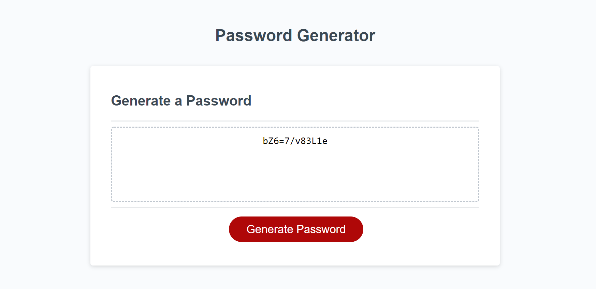

# Password Generator

## Description

This password generator returns a random password that is generated based on user-input criteria including the number of characters and what type of characters (lowercase, uppercase, numeric & special) to be included. The user responses are validated to ensure that a number between 8 and 128 is chosen for length of the password and that at least one character type is chosen to be included. The password generator will randomly choose characters one at a time from a list of characters of a chosen type, until the desired password length is reached. The character type is also randomly chosen, from the character types picked to be included, each time a new character is added to the password. The password characters are then checked to ensure that there is at least one character from each character type included. If there is an expected character type not included, then the function starts over and generates a new password until it generates one that has at least one of each expected character type.

Being able to generate a random password based on specific criteria makes it easy to produce a password that is both secure/strong and will meet certain requirements or guidelines.

### Screenshot

## Website

[https://emilyk221.github.io/Password-Generator](https://emilyk221.github.io/Password-Generator).

## References

I used the following references:
- [A thread on stack overflow discussing random password generation using JavaScript](https://stackoverflow.com/questions/1497481/javascript-password-generator)
- [MDN Web Docs - join() method](https://developer.mozilla.org/en-US/docs/Web/JavaScript/Reference/Global_Objects/Array/join)
- [A question on stack overflow about passing multiple arrays into a function using C++](https://stackoverflow.com/questions/55988161/passing-multiple-arrays-to-a-function). Even though this was a discussion about another coding language, it led me to the concept of creating an array of arrays.